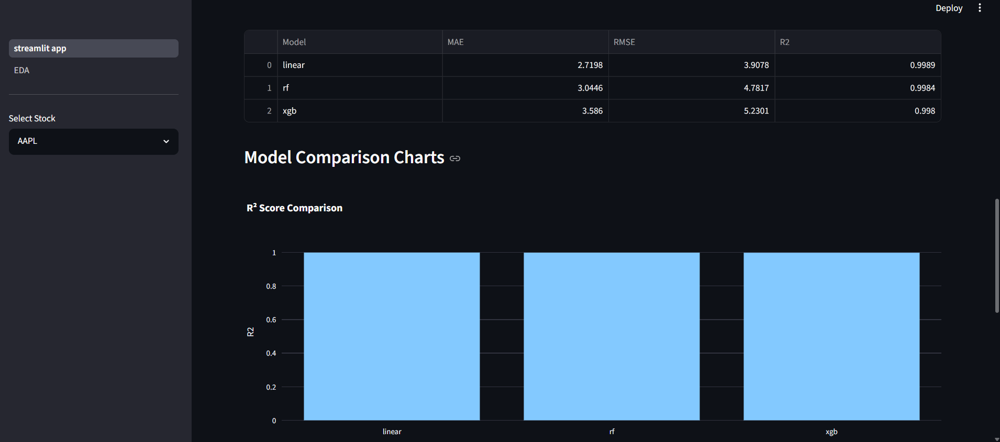

# AI Powered Stock Market Prediction System

## Overview

An end-to-end Machine Learning application that predicts stock prices using historical market data, technical indicators, and multiple machine learning models.

The system performs data preprocessing, feature engineering, model training, evaluation, forecasting, and recommendation generation through an interactive Streamlit dashboard and a FastAPI backend.

The project was designed to demonstrate a complete ML workflow from raw financial data to cloud deployment while comparing multiple prediction models and automatically selecting the best-performing model based on evaluation metrics.

---

## Live Demo

### Streamlit Dashboard

https://ai-stock-market-prediction-system.streamlit.app/

### FastAPI Documentation (Swagger UI)

https://ai-stock-market-prediction-system-zqce.onrender.com/docs

### FastAPI Base URL

https://ai-stock-market-prediction-system-zqce.onrender.com/

### GitHub Repository

https://github.com/Priyanshi-cell/AI-Stock-Market-Prediction-System

---

## Key Highlights

✅ End-to-End Machine Learning Pipeline

✅ Stock Price Prediction & Forecasting

✅ Technical Indicator Based Feature Engineering

✅ Multiple Model Comparison

✅ Automatic Best Model Selection

✅ Interactive Streamlit Dashboard

✅ FastAPI REST API Backend

✅ Swagger API Documentation

✅ Cloud Deployment using Streamlit Community Cloud & Render

✅ Production-Ready Project Structure

---

## Features

* Historical stock data analysis
* Technical indicator generation
* Multiple machine learning model comparison
* Stock price prediction
* 7-Day future price forecasting
* Buy / Hold / Sell recommendation system
* Interactive Streamlit dashboard
* FastAPI prediction endpoint
* Swagger API documentation
* Exploratory Data Analysis (EDA)
* Cloud deployment support

---

## Stocks Included

* Apple (AAPL)
* Microsoft (MSFT)
* Google (GOOGL)
* NVIDIA (NVDA)
* Tesla (TSLA)

---

## Project Workflow

1. Data Collection & Preprocessing
2. Feature Engineering
3. Technical Indicator Generation
4. Model Training
5. Model Evaluation
6. Best Model Selection
7. Prediction Generation
8. Future Forecasting
9. Recommendation Generation
10. Dashboard Visualization
11. API Development
12. Cloud Deployment

---

## Technical Indicators Used

### Trend Indicators

* MA10 (10-Day Moving Average)
* MA50 (50-Day Moving Average)

### Momentum Indicators

* RSI (Relative Strength Index)
* MACD

### Volatility Indicators

* Bollinger Bands
* Daily Returns
* Volatility

---

## Models Trained

| Model                   | Purpose                   |
| ----------------------- | ------------------------- |
| Linear Regression       | Baseline Prediction Model |
| Random Forest Regressor | Ensemble Learning Model   |
| XGBoost Regressor       | Gradient Boosting Model   |

---

## Evaluation Metrics

Models were evaluated using:

* MAE (Mean Absolute Error)
* RMSE (Root Mean Squared Error)
* R² Score

The best-performing model is automatically selected based on evaluation results.

---

## Project Structure

```text
AI-Stock-Market-Prediction-System/
│
├── api/
│   └── app.py
│
├── assets/
│   └── architecture.png
│
├── data/
├── models/
├── pages/
├── screenshots/
├── src/
│
├── streamlit_app.py
├── requirements.txt
├── runtime.txt
└── README.md
```

---

## Dashboard Screenshots

### Main Dashboard


### 7-Day Forecast


### Exploratory Data Analysis


### Model Comparison



### FastAPI Swagger Documentation


---

## System Architecture


---

## FastAPI Endpoints

### Root Endpoint

```http
GET /
```

### Stock Prediction Endpoint

```http
GET /predict/{stock}
```

### Example

```http
GET /predict/NVDA
```

### Sample Response

```json
{
  "stock": "NVDA",
  "prediction": 210.29
}
```

---

## Running Locally

### 1. Clone Repository

```bash
git clone https://github.com/Priyanshi-cell/AI-Stock-Market-Prediction-System.git

cd AI-Stock-Market-Prediction-System
```

### 2. Create Virtual Environment

```bash
python -m venv venv
```

### Activate Environment

#### Windows

```bash
venv\Scripts\activate
```

#### Linux / Mac

```bash
source venv/bin/activate
```

### 3. Install Dependencies

```bash
pip install -r requirements.txt
```

### 4. Run Streamlit Dashboard

```bash
streamlit run streamlit_app.py
```

### 5. Run FastAPI Server

```bash
uvicorn api.app:app --reload
```

### Swagger Documentation

```text
http://127.0.0.1:8000/docs
```

---

## Technologies Used

### Programming Language

* Python

### Machine Learning

* Scikit-Learn
* XGBoost
* Joblib

### Data Processing

* Pandas
* NumPy

### Visualization

* Plotly

### Backend

* FastAPI
* Uvicorn

### Frontend

* Streamlit

### Deployment

* Streamlit Community Cloud
* Render

---

## Project Outcome

This project demonstrates the complete lifecycle of a Machine Learning application:

* Data Collection and Cleaning
* Feature Engineering
* Technical Indicator Generation
* Model Training and Evaluation
* Forecast Generation
* Recommendation System Development
* Interactive Dashboard Development
* REST API Development
* Cloud Deployment

The final solution provides stock price forecasts, AI-generated recommendations, visual analytics, and production-ready deployment through both a web dashboard and API service.

---

## Future Improvements

* Real-time stock market integration
* Live market data streaming
* News sentiment analysis
* Portfolio optimization
* Deep Learning based forecasting (LSTM / Transformers)
* Automated model retraining pipeline
* MLOps monitoring and model versioning
* User authentication and watchlists
* Advanced risk analysis

---

## Author

### Priyanshi Kumrawat

Machine Learning | Artificial Intelligence | Data Science

GitHub:
https://github.com/Priyanshi-cell

LinkedIn:
https://www.linkedin.com/

---

## License

This project is developed for educational and portfolio purposes.
