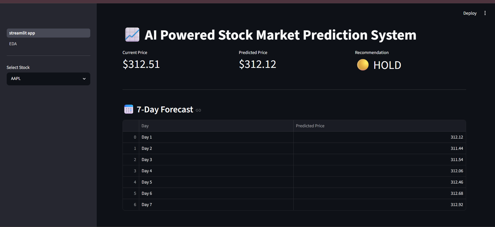
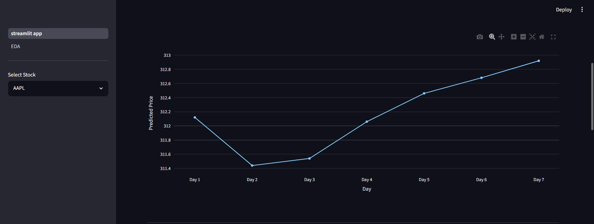
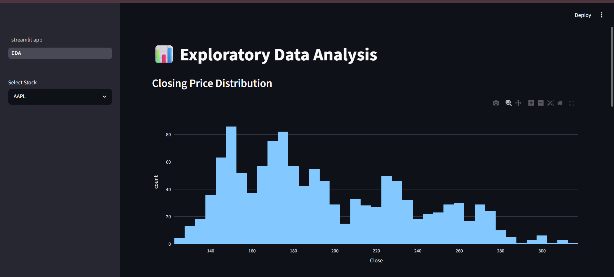
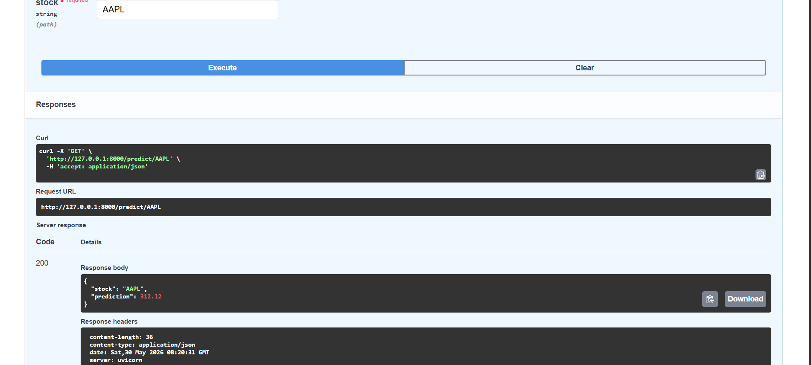
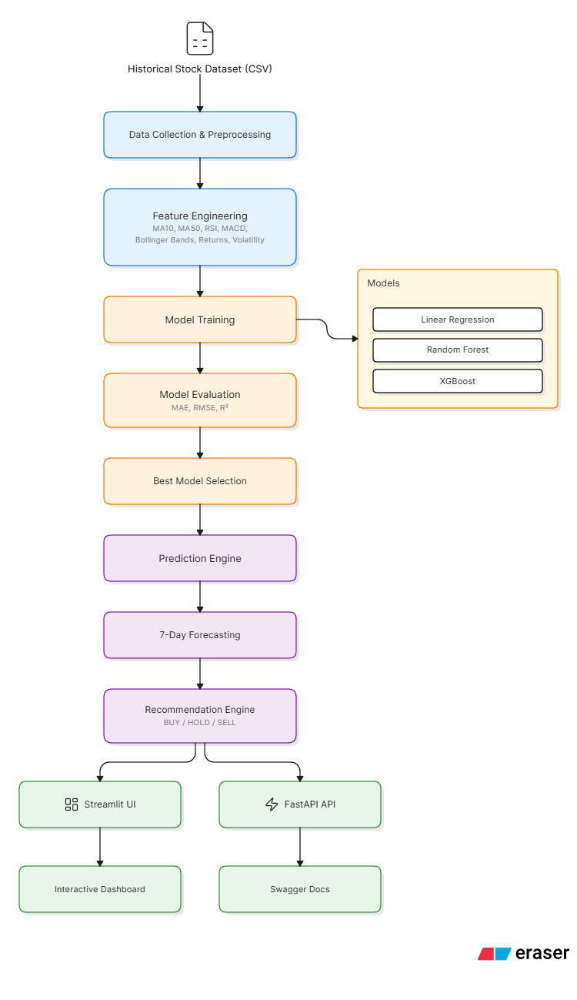

# AI Powered Stock Market Prediction System

## Overview

This project is an end-to-end Machine Learning application that predicts future stock prices using historical stock market data and technical indicators.

The system performs data preprocessing, feature engineering, model training, evaluation, forecasting, and recommendation generation through an interactive Streamlit dashboard and a FastAPI backend.

The objective was to build a practical stock prediction pipeline while comparing multiple machine learning models and selecting the best-performing model based on evaluation metrics.

---

## Features

* Historical stock data analysis
* Technical indicator generation
* Multiple machine learning model comparison
* Stock price prediction
* 7-Day future price forecasting
* Buy / Hold / Sell recommendation system
* Interactive Streamlit dashboard
* FastAPI prediction endpoint
* Swagger API documentation
* Exploratory Data Analysis (EDA)

---

## Stocks Included

* Apple (AAPL)
* Microsoft (MSFT)
* Google (GOOGL)
* NVIDIA (NVDA)
* Tesla (TSLA)

---

## Project Workflow

1. Data Collection and Preprocessing
2. Feature Engineering
3. Model Training
4. Model Evaluation
5. Best Model Selection
6. Prediction Generation
7. Forecasting
8. Recommendation Generation
9. Dashboard Visualization
10. API Deployment

---

## Technical Indicators Used

* MA10 (10-Day Moving Average)
* MA50 (50-Day Moving Average)
* RSI (Relative Strength Index)
* MACD
* Bollinger Bands
* Daily Returns
* Volatility

---

## Models Trained

| Model                   | Purpose                   |
| ----------------------- | ------------------------- |
| Linear Regression       | Baseline prediction model |
| Random Forest Regressor | Ensemble learning model   |
| XGBoost Regressor       | Gradient boosting model   |

---

## Evaluation Metrics

The models were evaluated using:

* MAE (Mean Absolute Error)
* RMSE (Root Mean Squared Error)
* R² Score

The best-performing model is automatically selected based on evaluation results.

---

## Project Structure

```text
StockMarketAI/
│
├── api/
├── assets/
├── data/
├── models/
├── pages/
├── screenshots/
├── src/
│
├── streamlit_app.py
├── requirements.txt
└── README.md
```

---

## Dashboard Screenshots

### Main Dashboard



### 7-Day Forecast



### Exploratory Data Analysis



### FastAPI Swagger Documentation



---

## Architecture



---

## Running Locally

### Install Dependencies

```bash
pip install -r requirements.txt
```

### Run Streamlit Dashboard

```bash
streamlit run streamlit_app.py
```

### Run FastAPI

```bash
uvicorn api.app:app --reload
```

### Swagger Documentation

```text
http://127.0.0.1:8000/docs
```

---

## Technologies Used

* Python
* Pandas
* NumPy
* Scikit-Learn
* XGBoost
* Plotly
* Streamlit
* FastAPI
* Joblib

---

## Future Improvements

* Real-time stock market integration
* News sentiment analysis
* Portfolio optimization
* Deep learning based forecasting
* Cloud deployment and monitoring

---

## Author

Priyanshi Kumrawat

Machine Learning | AI | Data Science
